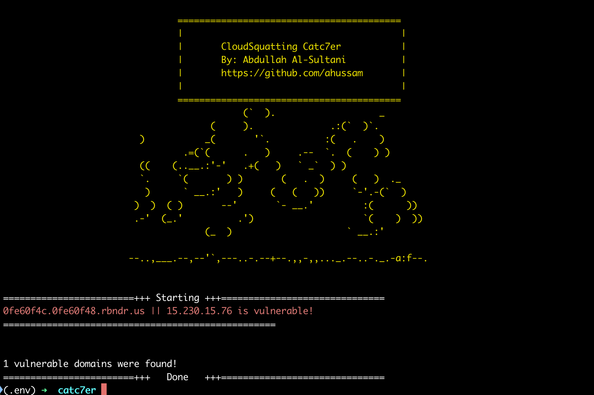

# CloudSquatting Catc7er



## Overview

**CloudSquatting Catc7er** is a tool designed to detect potential vulnerabilities caused by dangling DNS records. Dangling DNS records occur when a domain points to an IP address that is no longer in use by the intended service, often due to misconfigurations or decommissioned cloud resources. This can lead to cloud squatting, where an attacker can take control of the IP address and potentially serve malicious content. [Read more](https://developers.tiktok.com/blog/cloudsquatting-attack-explanation-and-mitigation-system-design).

## Supported Cloud Providers

The tool covers the following cloud providers:

- Amazon Web Services (AWS)
- Microsoft Azure
- Google Cloud Platform (GCP)
- Oracle Cloud Infrastructure (OCI)
- Yandex Cloud
- Linode
- Cloudflare

## Installation

1. **Clone the repository**:
    ```bash
    git clone https://github.com/ahussam/CloudSquatting-Catc7er.git
    cd CloudSquatting-Catc7er
    ```

2. **Create virtual enviroment**:
   ```bash
   python3 -m venv .env
   source .env/bin/activate
   ```
3. **Install dependencies**:
    ```bash
    pip install -r requirements.txt
    ```
## Usage

### Command Line

```bash
python catc7er.py <DOMAIN_OR_FILE>
```

### Examples 

* Check a single domain:

```bash
python catc7er.py google.com
```

* Check multiple domains from a file:

```bash 
python catc7er.py domains.txt
```

* Update cloud provider IP ranges:

```bash
python catc7er.py update
```

# Output 

The tool will output the results directly to the console, indicating whether each domain is vulnerable or not.

# Contributing
Contributions are welcome! Please fork the repository and submit a pull request for any improvements or bug fixes.

# License
This project is licensed under the MIT License.

# Acknowledgements
* Developed by Abdullah Al-Sultani
